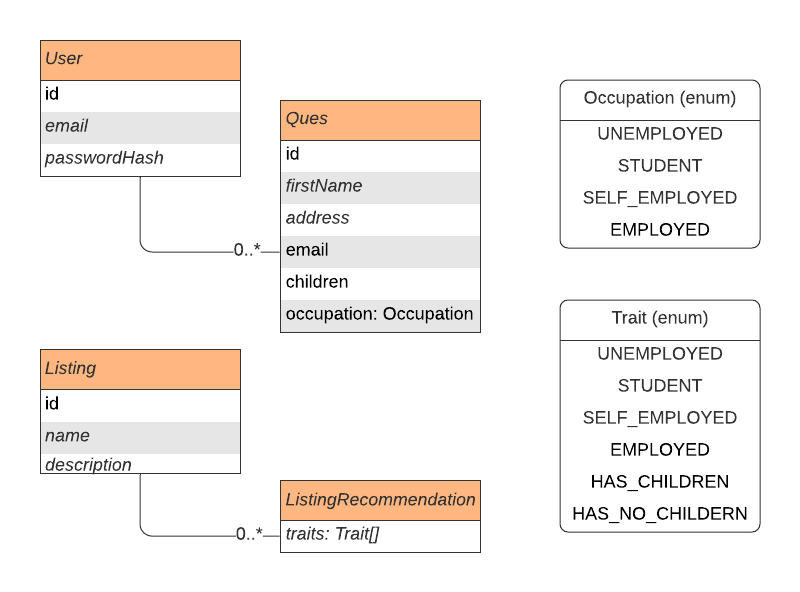

# Insurec API

- [Insurec API](#insurec-api)
  * [Description](#description)
  * [ERD and Design](#erd-and-design)
    + [ERD](#erd)
    + [Recommendation Design](#recommendation-design)
  * [Test Scenario](#test-scenario)
    + [1. Create User](#1-create-user)
    + [2. Submit Questionnare](#2-submit-questionnare)
    + [3. Fetch Recommended Listings](#3-fetch-recommended-listings)
  * [Installation](#installation)
  * [Migration](#migration)
  * [Running the app](#running-the-app)
  * [OpenAPI](#openapi)
  * [Test](#test)
  * [Prisma Client](#prisma-client)
  * [Notes](#notes)

## Description

POC RESTful API for Insurance Recommendations (or Listings in general) based on user traits determined by a set of inputs such as a questionnaire.

## ERD and Design

### ERD



### Recommendation Design
To generate a list of recommendations for users and to have this list be dynamically and easily extended I've decided to put a layer between User Questionnaires and Recommendations which is the Traits Layer.

From the Latest Questionnaires answeres (and later on any other factors) every user is assigned a set of traits, currently, traits are `EMPLOYED`, `STUDENT`, `SELF_EMPLOYED`, `UNEMPLOYED`, `HAS_CHILDREN`, `HAS_NO_CHILDERN`.

Those traits are evaluated in `UserRepository` as they are closer to the Business logic and not to the actual data. For example, if we add a "Number of car accidents in last 2 years:" question and based on the answer we set a threshold to which we give the user `CAREFUL_DRIVER` trait, we can use this trait to recommend (or not) a Car Insurance policy.

On the other side, `Listings` (policies) can have one or more `ListingRecommendations` which sets which traits this `Listing` should be recommended to.

When fetching a set of recommended listings for a set of traits it is in descending order based on the number of matches (The more specific the better like in CSS selectors for example).

This design can be also extended to allow for features like "Rank Boosts" which would be a monetizable feature to Boost a certain listing in the order of recommendation by simply adding a field `rankBoost` and use it in the query.

It doesn't however handle country/city-specific recommendations out-of-the-box and would probably need to add some filters to the fetch query.

## Test Scenario

### 1. Create User

You can create a new User with `POST /users` endpoint, within the response body is a `token` field.

You can use the `Authorize` button in the top-right to enter a token in the format `bearer [token]` for later requests to include it in the `Authorization` header.

### 2. Submit Questionnare

You can submit a new Questionnaire using `POST /questionnaire` endpoint.

Note that Based on occupation and children fields, traits are assigned to the user.

### 3. Fetch Recommended Listings

You can fetch recommended listings using `GET /users/[id]/recommendations` (under Listings).

Recommendations should be returned based on the user traits evaluated by the lastest Questionnaire answers.

## Installation

```bash
$ npm install
```

## Migration

```
npx prisma dev --preview-feature
```

Or

```
prisma migrate deploy --preview-feature
```

For non-development envs

## Running the app

```bash
# development
$ npm run start

# watch mode
$ npm run start:dev

# production mode
$ npm run start:prod
```

## OpenAPI

By default: `[host]:[port]/api` links to Swagger API.

## Test

```bash
# unit tests
$ npm run test

# e2e tests
$ npm run test:e2e

# test coverage
$ npm run test:cov
```

## Prisma Client

```
npx prisma studio
```

## Notes

- This is a POC so I skiped testing a few components and paths, you'll find that tests are mostly covering happy paths only.

- And Unlike Spotify API, this API may return a 500 if a case was not handled well. I had to tradeoff some resilience for faster POC.

- For Fetching Recommendation I've had to use a raw query because as of now Prisma does not support `@>` Psql operator.

- UserService calls to UserDao should be replaced with calls to UserRepository as it should abstracts which DAOs are being used.

- Endpoint for recommendation `users/[id]/recommendations` is made like this for testing, one that should be used by Clients is better to be `users/recommendations` directly same as `users/profiles` and uses JWT to get the user in concern.

- Role-Permission Based Access can be easily added by encoding it in the user's JWT token example of which how Auth0 adds roles, for this submissions most endpoints that are open should be protected by roles e.g. `post:recommendation`, `delete:listing`, etc.
